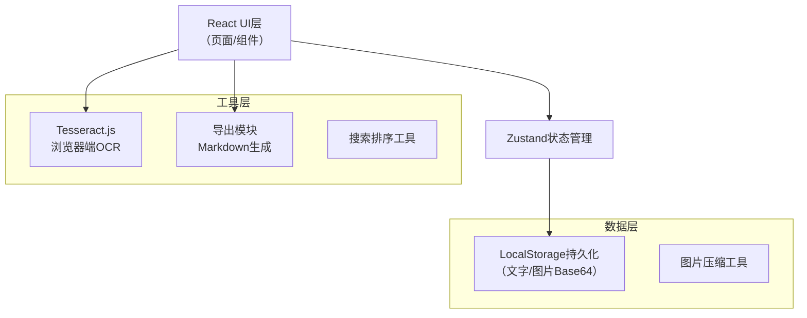
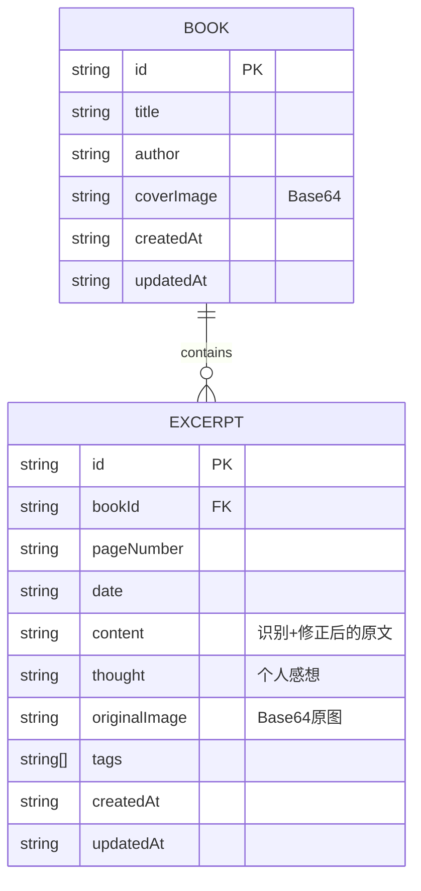

## 1. 架构设计



## 2. 技术选型说明

- **前端框架**：React 18 + TypeScript + Vite
- **样式方案**：TailwindCSS 3 + CSS变量自定义主题
- **状态管理**：Zustand（轻量级，适合本地数据）
- **路由**：React Router DOM
- **OCR引擎**：Tesseract.js（纯浏览器端，无需后端，支持中文简体识别）
- **图标**：Lucide React
- **数据持久化**：LocalStorage（文字+图片Base64，无需服务器）

## 3. 目录结构

```
src/
├── components/          # 通用组件
│   ├── BookCard.tsx     # 书籍卡片
│   ├── ExcerptCard.tsx  # 书摘卡片
│   ├── TagBadge.tsx     # 标签徽章
│   ├── Modal.tsx        # 弹窗
│   └── Button.tsx       # 按钮
├── pages/               # 页面
│   ├── BookShelf.tsx    # 书架页
│   ├── ExcerptList.tsx  # 书摘列表页
│   └── ExcerptEditor.tsx # 书摘编辑页
├── store/               # 状态管理
│   └── useBookStore.ts  # 书籍/书摘store
├── utils/               # 工具函数
│   ├── ocr.ts           # OCR封装
│   ├── storage.ts       # 本地存储封装
│   ├── export.ts        # 导出工具
│   └── image.ts         # 图片压缩工具
├── types/               # 类型定义
│   └── index.ts
├── App.tsx
├── main.tsx
└── index.css            # 全局样式+主题变量
```

## 4. 路由定义

| 路由 | 用途 |
|------|------|
| `/` | 书架页面 - 展示所有书籍 |
| `/book/:bookId` | 书摘列表页 - 某本书的所有书摘 |
| `/book/:bookId/new` | 新建书摘页 |
| `/book/:bookId/edit/:excerptId` | 编辑书摘页 |

## 5. 数据模型

### 5.1 数据模型定义



### 5.2 TypeScript类型定义

```typescript
interface Book {
  id: string;
  title: string;
  author: string;
  coverImage: string; // Base64
  createdAt: string;
  updatedAt: string;
}

interface Excerpt {
  id: string;
  bookId: string;
  pageNumber: string;
  date: string;
  content: string;
  thought: string;
  originalImage: string; // Base64
  tags: string[];
  createdAt: string;
  updatedAt: string;
}

type SortType = 'date-desc' | 'date-asc' | 'page-desc' | 'page-asc';

interface AppState {
  books: Book[];
  excerpts: Excerpt[];
  activeBookId: string | null;
  searchQuery: string;
  activeTags: string[];
  sortType: SortType;
}
```

## 6. 核心技术方案

### 6.1 本地存储方案
- 使用 `localStorage` 存储所有数据
- 图片使用 Canvas 压缩后转为 Base64 存储
- 单条数据限制在 5MB 以内（LocalStorage 通常配额 5-10MB）
- 数据变化时自动持久化，页面加载时自动恢复

### 6.2 OCR识别方案
- 使用 Tesseract.js v4+，浏览器端运行
- 预加载中文简体语言包 `chi_sim`
- 识别过程显示进度条和状态文字
- 识别结果输出到可编辑文本框，用户可手动修正

### 6.3 搜索排序方案
- 搜索：对 `content`、`thought`、`tags` 字段进行模糊匹配
- 标签筛选：多选标签，AND 逻辑匹配
- 排序：支持按日期（升/降）、页码（升/降）四种排序
- 搜索+筛选+排序可组合使用

### 6.4 导出方案
- 生成标准 Markdown 格式
- 书名作为大标题，作者信息在副标题
- 书摘按当前排序输出，包含页码、日期、标签、原文、感想
- 原文使用引用块 `>` 标记，感想使用斜体区分
- 使用 `Blob` + `URL.createObjectURL` 触发浏览器下载
