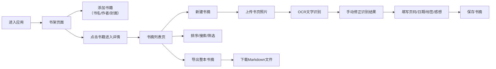

## 1. 产品概述

书摘整理工具是一款面向深度阅读者的纯前端应用，帮助用户将纸质书中的精彩内容转化为可检索、可归档的数字笔记。用户可以上传书页照片进行OCR识别，手动修正识别结果，添加页码、日期和个人感想，按书归档整理，并通过标签和关键词快速检索。最终可将整本书的书摘导出为干净的文档。所有数据存储在浏览器本地，保障隐私安全。

- **目标用户**：热爱阅读、喜欢做书摘的深度读者
- **核心价值**：打通纸质书到数字笔记的最后一公里，让书摘整理变得轻松高效
- **目标场景**：日常阅读后快速归档、主题阅读素材整理、写作时引用检索

## 2. 核心特性

### 2.1 用户角色

| 角色 | 注册方式 | 核心权限 |
|------|----------|----------|
| 普通用户 | 无需注册，直接使用 | 所有功能，数据存储在本地浏览器 |

### 2.2 功能模块

1. **书架页面**：书籍列表展示、添加/编辑/删除书籍、封面上传
2. **书摘列表页**：按书展示书摘、时间线/页码排序切换、标签/关键词搜索
3. **书摘编辑器**：图片上传、OCR文字识别、手动修正、页码日期填写、标签添加、感想记录
4. **导出功能**：单本书的所有书摘导出为Markdown文档

### 2.3 页面详情

| 页面名称 | 模块名称 | 功能描述 |
|---------|----------|----------|
| 书架页 | 书籍网格 | 卡片式展示书籍封面、书名、作者、书摘数量 |
| 书架页 | 添加书籍 | 弹出表单填写书名、作者、上传封面图片 |
| 书架页 | 书籍操作 | 编辑书籍信息、删除书籍（含确认） |
| 书摘列表页 | 顶部工具栏 | 返回书架、搜索框、排序切换（时间线/页码）、标签筛选、新建书摘、导出按钮 |
| 书摘列表页 | 书摘卡片流 | 按排序展示书摘卡片，包含页码、日期、标签、原文、感想、原图预览 |
| 书摘编辑器 | 图片上传区 | 拖拽或点击上传书页照片，实时预览 |
| 书摘编辑器 | OCR识别区 | 显示识别进度，识别结果可编辑文本框，支持手动改错 |
| 书摘编辑器 | 元数据区 | 页码输入、日期选择器、标签多选（预设+自定义） |
| 书摘编辑器 | 感想区 | 多行文本框记录个人阅读感想 |
| 书摘编辑器 | 操作栏 | 保存、取消、删除按钮 |

## 3. 核心流程

## 4. 用户界面设计

### 4.1 设计风格

**风格定位**：温暖书房 / 优雅编辑风

- **主色调**：暖米白 `#f5f1e8` 背景，搭配深棕 `#3d2c1e` 文字，营造纸质书的温暖感
- **点缀色**：墨绿 `#4a6b5a` 用于按钮和标签，赭石 `#b86f50` 用于强调和重要操作
- **按钮风格**：圆角矩形，轻微阴影，hover时有微妙的上浮和颜色加深效果
- **字体**：标题使用「Lora」衬线字体，正文使用「Inter」无衬线字体，中英文搭配优雅
- **布局风格**：卡片式布局，充足留白，柔和阴影，边角圆润
- **视觉细节**：微妙的纸质纹理背景，轻微的噪点叠加，书籍卡片有书脊厚度效果

### 4.2 页面设计概览

| 页面名称 | 模块名称 | UI元素 |
|---------|----------|--------|
| 书架页 | 书籍网格 | 3-4列响应式网格，卡片带悬停动画，封面为主视觉 |
| 书架页 | 空状态 | 优雅的插画风格空书架提示，引导添加第一本书 |
| 书摘列表页 | 时间线视图 | 左侧时间轴，卡片错落排列，日期标记醒目 |
| 书摘列表页 | 页码视图 | 按页码升序排列，页码徽章突出显示 |
| 书摘编辑器 | OCR进度 | 线性进度条，识别状态文字提示 |
| 书摘编辑器 | 文本对比 | 左侧原图缩略图，右侧可编辑文本，方便对照修改 |

### 4.3 响应式

- **桌面优先**：1200px+ 展示完整布局
- **平板适配**：768px-1199px 书架网格调整为2-3列
- **手机适配**：<768px 单列布局，导航简化为底部tab，标签筛选折叠
- **触控优化**：按钮最小高度44px，输入框足够间距，滑动操作流畅

### 4.4 微交互

- 页面加载时卡片依次淡入（staggered animation）
- 书籍卡片悬停时轻微上浮，阴影加深
- OCR识别有平滑的进度动画
- 标签添加/删除有缩放过渡
- 保存成功有轻柔的提示动效
